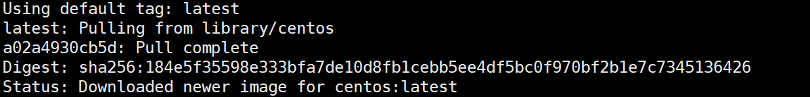
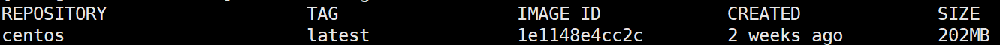
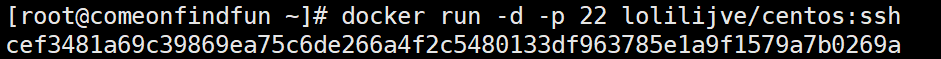
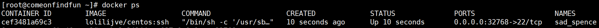
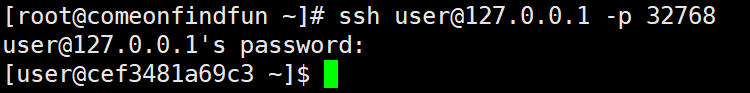

##### 通过Dockerfile创建支持ssh功能的centos镜像 的过程包括：

1. 获取centos镜像
2. 编辑Dockerfile并创建支持ssh的centos镜像
3. 运行镜像


###### 获取centos镜像

```shell
$ docker pull centos
```

> 

然后查看镜像：

```shell
$ docker images
```

> 


###### 编辑Dockerfile并创建支持ssh的centos镜像

在当前目录编辑Dockerfile（不存在文件就自动创建）：

```shell
$ vim Dockerfile
```

我的Dockerfile：

```dockerfile
FROM        centos
MAINTAINER  lolilijve "lolilijve@gmail.com"
#安装ssh
RUN         yum install -y openssh openssh-server openssh-clients
#设置公钥，用户，密码等
RUN         mkdir -p /var/run/sshd
RUN         ssh-keygen -t rsa -f /etc/ssh/ssh_host_rsa_key
RUN         ssh-keygen -t dsa -f /etc/ssh/ssh_host_dsa_key
RUN         /bin/echo 'root:123456' |chpasswd
RUN         useradd user
RUN         /bin/echo 'user:123456' |chpasswd
RUN         /bin/sed -i 's/.*session.*required.*pam_loginuid.so.*/session optional pam_loginuid.so/g' /etc/pam.d/sshd
RUN         /bin/echo -e "LANG=\"en_US.UTF-8\"" > /etc/default/local
#暴露端口
EXPOSE      22
CMD         /usr/sbin/sshd -D
```

通过Dockerfile创建镜像：

```shell
$ docker build -f 'Dockerfile' -t lolilijve/centos:ssh .
```



###### 运行镜像

```shell
$ docker run -d -p 22 lolilijve/centos:ssh
```



通过ssh联入，（此处端口在上一条执行结果中，用户名在Dockerfile有设置）：

```shell
$ ssh user@127.0.0.1 -p 32768
```



此时，已完成通过Dockerfile创建支持ssh功能的centos镜像及镜像运行。

